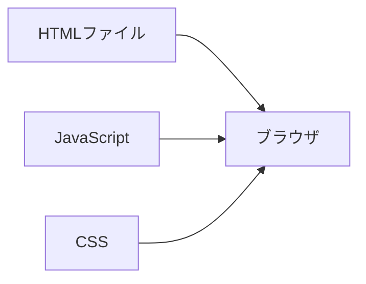
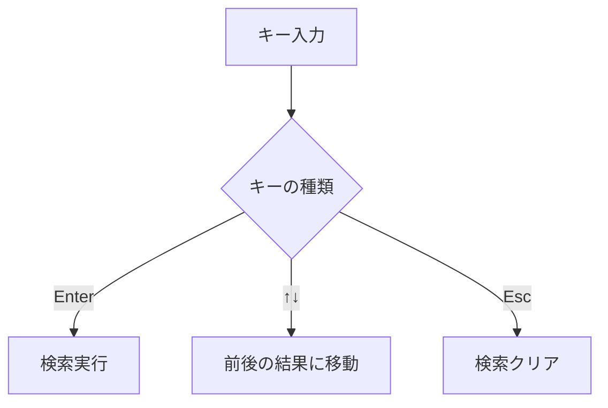
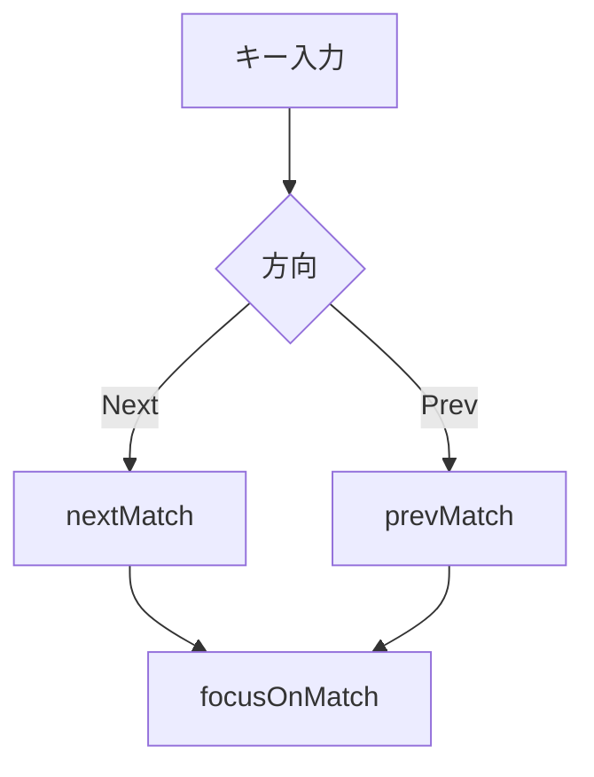
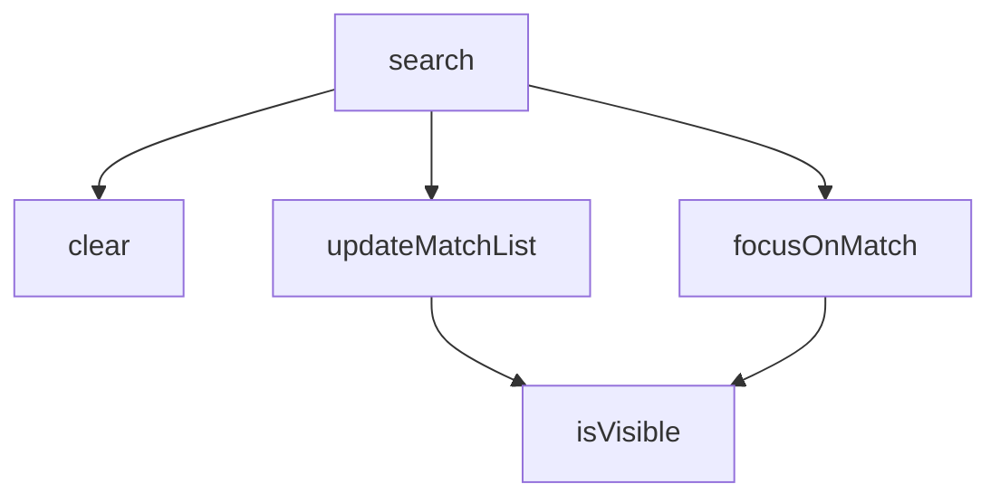
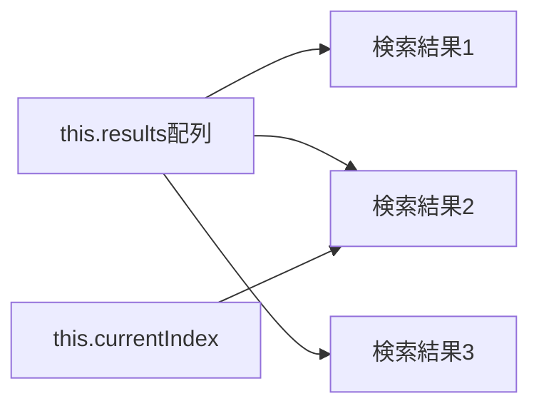
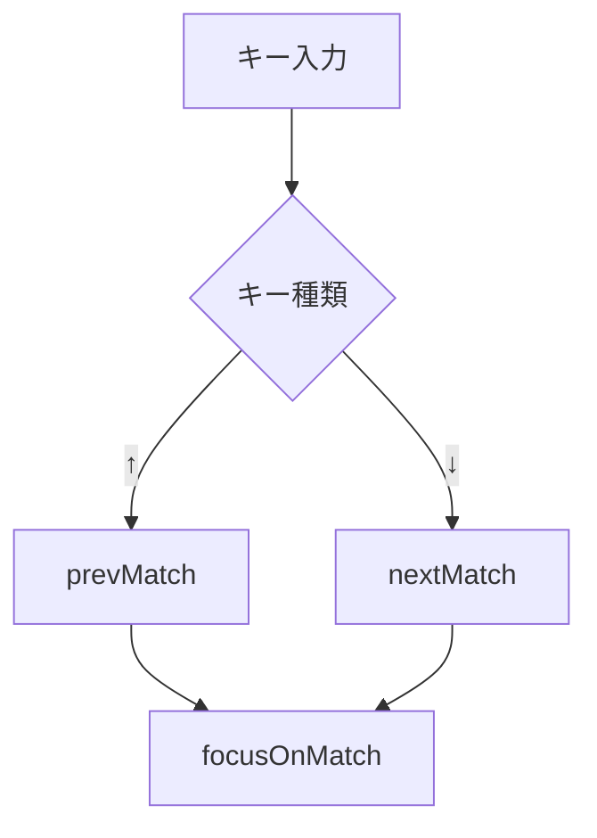

small-spring: 保守性を高めたい。
そもそも、htmlとjsがあってどう動いているの？グローバル変数はどう変化するの？

Workspace: ワークスペース情報を収集していますページの構造と動作を分析しましょう。

### 基本構造

1. **HTMLファイル** (brain_graph_interactive.html)
- ネットワークグラフを表示する`<div id="mynetwork">`
- レベルフィルター用の入力フィールド`<input id="levelInput">`
- 検索用の入力フィールド`<input id="searchBox">`
- 検索結果表示エリア`<div id="matchList">`

2. **グローバル変数**
```javascript
// 検索関連
let matchResults = [];     // 検索結果のノード配列
let matchIndex = 0;       // 現在選択中の検索結果インデックス
let visibleMatchIndexes = []; // 可視状態の検索結果インデックス

// グラフ関連
const network;  // vis.jsのネットワークインスタンス
const allNodes; // 全ノードデータ（data/nodes.jsから読み込み）
const allEdges; // 全エッジデータ（data/edges.jsから読み込み）
```

### 主な改善提案

1. **モジュール化**
```javascript
// SearchManager.js
class SearchManager {
    constructor() {
        this.results = [];
        this.currentIndex = 0;
        this.visibleIndexes = [];
    }
    
    search(keyword, nodes, maxLevel) {
        // 検索ロジックをカプセル化
    }
}

// NetworkManager.js
class NetworkManager {
    constructor(container, nodes, edges) {
        this.network = new vis.Network(/* ... */);
    }
    
    filterByLevel(maxLevel) {
        // フィルタリングロジックをカプセル化
    }
}
```

2. **イベントシステムの導入**
```javascript
// EventBus.js
class EventBus {
    constructor() {
        this.events = {};
    }
    
    on(event, callback) {
        // イベントリスナーの登録
    }
    
    emit(event, data) {
        // イベントの発火
    }
}
```

3. **設定の外部化**
```javascript
// config.js
export const NetworkConfig = {
    physics: {
        barnesHut: {
            gravitationalConstant: -12000,
            springLength: 100,
            springConstant: 0.04
        },
        minVelocity: 1.0
    }
};
```

4. **状態管理の改善**
```javascript
// State.js
class ApplicationState {
    constructor() {
        this.searchState = {
            keyword: '',
            results: [],
            currentIndex: 0
        };
        this.networkState = {
            currentLevel: 1,
            visibleNodes: new Set()
        };
    }
}
```

これらの改善により：
- コードの責任範囲が明確になる
- テストが書きやすくなる
- 状態の変更が追跡しやすくなる
- 機能の拡張が容易になる

small-spring: @workspace 具体的な実装例を教えて。

Workspace: ワークスペース情報を収集しています`@workspace` accuracy and speed can be improved by building a remote workspace index. [詳細情報](https://aka.ms/vscode-copilot-workspace-remote-index)

Build remote workspace index

アプリケーションの改善案を具体的な実装例で示します。

まず、以下のような構造でファイルを整理します：

```
scripts/web/
├── index.html
├── style.css
├── config/
│   └── network-config.js
├── modules/
│   ├── NetworkManager.js
│   ├── SearchManager.js
│   └── EventBus.js
└── main.js
```

1. **設定ファイルの分離**

````javascript
export const NetworkConfig = {
    physics: {
        barnesHut: {
            gravitationalConstant: -12000,
            springLength: 100,
            springConstant: 0.04
        },
        minVelocity: 1.0,
    },
    layout: {
        improvedLayout: false
    }
};
````

2. **イベントバス実装**

````javascript
export class EventBus {
    constructor() {
        this.listeners = new Map();
    }

    on(event, callback) {
        if (!this.listeners.has(event)) {
            this.listeners.set(event, []);
        }
        this.listeners.get(event).push(callback);
    }

    emit(event, data) {
        if (this.listeners.has(event)) {
            this.listeners.get(event).forEach(callback => callback(data));
        }
    }
}
````

3. **ネットワーク管理クラス**

````javascript
import { NetworkConfig } from '../config/network-config.js';

export class NetworkManager {
    constructor(container, eventBus) {
        this.eventBus = eventBus;
        this.network = new vis.Network(container, { nodes: [], edges: [] }, NetworkConfig);
        
        this.network.on("selectNode", params => {
            this.eventBus.emit("nodeSelected", params);
        });
    }

    setData(nodes, edges) {
        this.network.setData({
            nodes: new vis.DataSet(nodes),
            edges: new vis.DataSet(edges)
        });
    }

    filterByLevel(allNodes, allEdges, maxLevel) {
        const visibleNodes = allNodes.get().filter(n => n.level <= maxLevel);
        const visibleIds = new Set(visibleNodes.map(n => n.id));
        const visibleEdges = allEdges.get().filter(e => 
            visibleIds.has(e.from) && visibleIds.has(e.to)
        );

        this.setData(visibleNodes, visibleEdges);
        this.eventBus.emit("dataFiltered", { visibleNodes, visibleEdges });
    }

    focusOnNode(nodeId) {
        this.network.selectNodes([nodeId]);
        this.network.focus(nodeId, {
            scale: 1.5,
            animation: { duration: 500 }
        });
    }
}
````

4. **検索管理クラス**

````javascript
export class SearchManager {
    constructor(eventBus) {
        this.eventBus = eventBus;
        this.results = [];
        this.currentIndex = 0;
        this.visibleIndexes = [];

        this.searchBox = document.getElementById("searchBox");
        this.matchStatus = document.getElementById("matchStatus");
        this.matchList = document.getElementById("matchList");

        this.setupEventListeners();
    }

    setupEventListeners() {
        this.searchBox.addEventListener("input", () => this.search());
        this.eventBus.on("dataFiltered", () => this.updateVisibility());
    }

    search() {
        const keyword = this.searchBox.value.toLowerCase();
        if (!keyword) {
            this.clear();
            return;
        }

        this.results = allNodes.get().filter(n =>
            n.label.toLowerCase().includes(keyword) ||
            (n.title && n.title.toLowerCase().includes(keyword))
        );

        this.currentIndex = 0;
        this.updateMatchList();
        this.focusCurrentMatch();
    }

    updateMatchList() {
        // 既存のupdateMatchList関数の実装
    }

    focusCurrentMatch() {
        if (this.results.length > 0) {
            const currentNode = this.results[this.currentIndex];
            this.eventBus.emit("focusNode", currentNode.id);
        }
    }

    clear() {
        this.results = [];
        this.currentIndex = 0;
        this.searchBox.value = "";
        this.matchStatus.textContent = "";
        this.matchList.innerHTML = "";
        this.eventBus.emit("searchCleared");
    }
}
````

5. **メインアプリケーション**

````javascript
import { EventBus } from './modules/EventBus.js';
import { NetworkManager } from './modules/NetworkManager.js';
import { SearchManager } from './modules/SearchManager.js';

class Application {
    constructor() {
        this.eventBus = new EventBus();
        this.container = document.getElementById("mynetwork");
        
        this.networkManager = new NetworkManager(this.container, this.eventBus);
        this.searchManager = new SearchManager(this.eventBus);
        
        this.setupEventListeners();
        this.initialize();
    }

    setupEventListeners() {
        document.getElementById("levelInput")
            .addEventListener("change", e => this.onLevelChange(e));
    }

    initialize() {
        const initialLevel = parseInt(document.getElementById("levelInput").value);
        this.networkManager.filterByLevel(allNodes, allEdges, initialLevel);
    }

    onLevelChange(event) {
        const maxLevel = parseInt(event.target.value);
        this.networkManager.filterByLevel(allNodes, allEdges, maxLevel);
    }
}

// アプリケーションの起動
document.addEventListener('DOMContentLoaded', () => {
    new Application();
});
````

この実装により：

- 責任の分離が明確になる
- コンポーネント間の依存関係が疎結合になる
- テストが容易になる
- 状態管理が整理される
- 機能の拡張が容易になる

また、EventBusを使用することで、コンポーネント間の通信が明確になり、デバッグも容易になります。

small-spring: eventbusってどういう意味なの？一般的な単語？

GitHub Copilot: EventBus（イベントバス）は、ソフトウェア開発で一般的に使用されるデザインパターンの1つです。以下に説明します：

### EventBusとは

1. **基本概念**
- コンポーネント間の通信を仲介するメッセージングシステム
- Publish-Subscribe（出版-購読）パターンの実装
- Observer（観察者）パターンの拡張版

2. **シンプルな例**
```javascript
// 従来の直接的な通信
searchManager.onSearchComplete(() => {
    networkManager.updateView();
    statusBar.updateStatus();
    sidebar.refresh();
});

// EventBusを使用した通信
eventBus.emit('searchComplete', results);
// 別々の場所で
eventBus.on('searchComplete', results => networkManager.updateView());
eventBus.on('searchComplete', results => statusBar.updateStatus());
eventBus.on('searchComplete', results => sidebar.refresh());
```

### メリット

1. **疎結合化**
- コンポーネントが互いを直接知る必要がない
- 各部品の独立性が高まる

2. **スケーラビリティ**
```javascript
// 新機能追加が容易
eventBus.on('searchComplete', results => {
    // 新しい機能を追加しても他のコードに影響しない
    analytics.logSearchEvent(results);
});
```

3. **デバッグのしやすさ**
```javascript
// デバッグ用のリスナーを簡単に追加
eventBus.on('*', (eventName, data) => {
    console.log(`Event: ${eventName}`, data);
});
```

### 実際の使用例

```javascript
class EventBus {
    constructor() {
        this.listeners = new Map();
    }

    // イベントの購読
    on(eventName, callback) {
        if (!this.listeners.has(eventName)) {
            this.listeners.set(eventName, new Set());
        }
        this.listeners.get(eventName).add(callback);
    }

    // イベントの発火
    emit(eventName, data) {
        const callbacks = this.listeners.get(eventName);
        if (callbacks) {
            callbacks.forEach(callback => {
                try {
                    callback(data);
                } catch (error) {
                    console.error(`Error in ${eventName} handler:`, error);
                }
            });
        }
    }

    // イベントの購読解除
    off(eventName, callback) {
        const callbacks = this.listeners.get(eventName);
        if (callbacks) {
            callbacks.delete(callback);
        }
    }
}

// 使用例
const eventBus = new EventBus();

// 検索完了時のイベント購読
eventBus.on('searchComplete', results => {
    console.log('検索結果を表示:', results);
});

// どこか別の場所で検索が完了したとき
eventBus.emit('searchComplete', ['結果1', '結果2']);
```

このパターンは、Vueやnuxt、React-Reduxなど、多くのモダンなフレームワークでも採用されている一般的な設計パターンです。

small-spring: documentとかthisとかあるのは何？thisはPythonでいうselfみたいなものっぽいことはわかった

GitHub Copilot: JavaScriptにおける`document`と`this`について説明します：

### `document`について

`document`はブラウザが提供するグローバルオブジェクトで、HTML文書全体を表現します。

```javascript
// DOMへのアクセス例
document.getElementById("myButton")     // ID指定で要素を取得
document.querySelector(".myClass")      // CSS セレクタで要素を取得
document.createElement("div")          // 新しい要素の作成
```

### `this`について

`this`は、現在のコンテキスト（実行文脈）を参照するキーワードです。

#### 基本的な使い方例：

1. **クラス/オブジェクトのメソッド内**
```javascript
class User {
    constructor(name) {
        this.name = name;    // このクラスのプロパティとして設定
    }
    
    sayHello() {
        console.log(`こんにちは、${this.name}さん`);  // 自分のプロパティにアクセス
    }
}
```

2. **イベントハンドラ内**
```javascript
class Button {
    constructor() {
        this.count = 0;
        this.button = document.getElementById("myButton");
        
        // アロー関数を使用してthisを保持
        this.button.addEventListener("click", () => {
            this.count++;  // このクラスのcountプロパティを参照
            console.log(this.count);
        });
    }
}
```

#### `this`の注意点：

1. **通常の関数とアロー関数の違い**
```javascript
class Counter {
    constructor() {
        this.count = 0;
        
        // 間違った例：通常の関数
        this.button.onclick = function() {
            this.count++;  // ⚠️ thisがbuttonを指してしまう
        }
        
        // 正しい例：アロー関数
        this.button.onclick = () => {
            this.count++;  // ✅ thisがCounterクラスを指す
        }
    }
}
```

2. **バインド（bind）の使用**
```javascript
class Example {
    constructor() {
        this.name = "例";
        
        // thisを明示的にバインド
        this.handleClick = this.handleClick.bind(this);
    }
    
    handleClick() {
        console.log(this.name);
    }
}
```

### まとめ

- `document`：HTMLドキュメント全体を操作するためのグローバルオブジェクト
- `this`：Pythonの`self`に似ているが、コンテキストによって参照先が変わる
  - クラスメソッド内：インスタンス自身
  - イベントハンドラ：イベントの発生元要素（ただしアロー関数使用で変更可能）
  - グローバルスコープ：window（ブラウザ環境の場合）

これらの概念は、オブジェクト指向プログラミングとDOMの操作において重要な役割を果たします。

small-spring: そのDOMってやつ！なんだろう
() => {...} みたいなのも初めてみた

GitHub Copilot: DOMとアロー関数について説明します！

### DOM (Document Object Model)
DOMは、HTMLやXMLドキュメントをツリー構造で表現するプログラミングインターフェースです。

#### DOMツリーの例
```
document
├── html
│   ├── head
│   │   ├── title
│   │   └── meta
│   └── body
│       ├── div
│       │   └── p
│       └── button
```

#### DOMの基本操作
```javascript
// 要素の取得
const button = document.getElementById("myButton");
const paragraphs = document.getElementsByTagName("p");

// 要素の作成と追加
const newDiv = document.createElement("div");
document.body.appendChild(newDiv);

// 要素の内容変更
button.textContent = "クリックして";
button.style.backgroundColor = "blue";
```

### アロー関数 (`=>`)
アロー関数は、JavaScriptのES6で導入された関数の短縮構文です。

#### 基本的な書き方の比較
```javascript
// 従来の関数宣言
function add(a, b) {
    return a + b;
}

// アロー関数
const add = (a, b) => {
    return a + b;
}

// さらに短縮形（1行の場合）
const add = (a, b) => a + b;
```

#### アロー関数の特徴
1. **`this`のバインドが保持される**
```javascript
class Counter {
    constructor() {
        this.count = 0;
        
        // 従来の関数（thisが変わってしまう）
        document.getElementById("button").onclick = function() {
            this.count++; // ⚠️エラー
        }
        
        // アロー関数（thisが保持される）
        document.getElementById("button").onclick = () => {
            this.count++; // ✅OK
        }
    }
}
```

2. **短い処理の場合は{}とreturnを省略可能**
```javascript
// 配列の処理例
const numbers = [1, 2, 3, 4, 5];

// 従来の方法
const doubled = numbers.map(function(n) {
    return n * 2;
});

// アロー関数
const doubled = numbers.map(n => n * 2);
```

3. **パラメータが1つの場合は()も省略可能**
```javascript
// パラメータなし
const sayHello = () => console.log("こんにちは");

// パラメータ1つ
const square = x => x * x;

// パラメータ2つ以上
const add = (a, b) => a + b;
```

このように、DOMはWebページの構造を操作するためのインターフェース、アロー関数は関数をより簡潔に書くための構文として、モダンなJavaScript開発では頻繁に使用されます。

small-spring: 関数を宣言してたんだ！なるほどね～

GitHub Copilot: はい！JavaScriptでの関数宣言には主に3つの方法があります：

### 1. 従来の関数宣言
```javascript
function sayHello(name) {
    console.log(`こんにちは、${name}さん`);
}
```

### 2. 関数式
```javascript
const sayHello = function(name) {
    console.log(`こんにちは、${name}さん`);
};
```

### 3. アロー関数（最新の書き方）
```javascript
const sayHello = (name) => {
    console.log(`こんにちは、${name}さん`);
};
```

それぞれの特徴を見てみましょう：

### 関数宣言の違い

1. **巻き上げ（hoisting）**
```javascript
// これはOK！（関数宣言）
sayHello("太郎");

function sayHello(name) {
    console.log(`こんにちは、${name}さん`);
}

// これはエラー！（関数式）
sayHi("太郎");  // ⚠️ エラー

const sayHi = function(name) {
    console.log(`こんにちは、${name}さん`);
};
```

2. **`this`の扱い**
```javascript
class User {
    constructor(name) {
        this.name = name;
        
        // 従来の関数
        this.greet = function() {
            setTimeout(function() {
                console.log(this.name);  // ⚠️ undefined
            }, 100);
        };
        
        // アロー関数
        this.greetArrow = function() {
            setTimeout(() => {
                console.log(this.name);  // ✅ 正しく動作
            }, 100);
        };
    }
}
```

3. **簡潔な記述（アロー関数の場合）**
```javascript
// 1行で返す場合
const add = (a, b) => a + b;

// 配列の処理でよく使う
const numbers = [1, 2, 3];
const doubled = numbers.map(num => num * 2);
```

特に最近のJavaScriptでは、`this`の扱いが簡単で簡潔に書けるアロー関数が好まれる傾向にあります。ただし、適切な使い分けも重要です。

small-spring:  document.getElementByIdについてもう一度教えて

GitHub Copilot: # DOMでの要素取得について

## `getElementById`の基本

`getElementById`はDOMで最も一般的な要素取得メソッドの1つです。

### 基本的な使い方

````javascript
// HTMLの要素を取得
const button = document.getElementById("submitButton");
const searchBox = document.getElementById("searchBox");
````

## 実践的な例

### 1. 要素の取得と操作
````javascript
// HTML要素の取得と値の変更
const titleElement = document.getElementById("pageTitle");
titleElement.textContent = "新しいタイトル";
titleElement.style.color = "blue";
````

### 2. イベントリスナーの追加
````javascript
const button = document.getElementById("submitButton");
button.addEventListener("click", () => {
    console.log("ボタンがクリックされました");
});
````

### 3. フォーム要素の値を取得
````javascript
const inputField = document.getElementById("userInput");
console.log(inputField.value);  // 入力値を取得
````

## よくあるエラーと注意点

1. **要素が見つからない場合**
- 存在しないIDを指定すると`null`が返される
````javascript
const element = document.getElementById("存在しないID");
console.log(element);  // null

// 安全な使い方
if (element) {
    element.textContent = "テキスト";  // 要素が存在する場合のみ実行
}
````

2. **大文字小文字の区別**
````html
<div id="MyElement">テスト</div>
````
````javascript
// IDは完全一致する必要がある
const element = document.getElementById("MyElement");    // ✅ OK
const wrong = document.getElementById("myElement");      // ❌ null
````

## 実用的なTips

### 1. 複数の操作をまとめる
````javascript
const element = document.getElementById("target");
if (element) {
    element.classList.add("active");
    element.style.display = "block";
    element.textContent = "更新されました";
}
````

### 2. 非同期処理での使用
````javascript
// DOMの読み込み完了後に実行
document.addEventListener("DOMContentLoaded", () => {
    const element = document.getElementById("target");
    if (element) {
        // 安全に操作できる
    }
});
````

`getElementById`は高速で信頼性が高いため、特定の要素を取得する際の第一選択として使われます。要素のIDは一意である必要があります。

small-spring: イベントリスナーって何？

GitHub Copilot: # イベントリスナーについて説明します

イベントリスナーは、特定のイベント（クリック、キー入力など）が発生したときに実行される関数です。

## 基本的な使い方

### 1. クリックイベントの例
````javascript
const button = document.getElementById("myButton");

// イベントリスナーを追加
button.addEventListener("click", () => {
    console.log("ボタンがクリックされました！");
});
````

### 2. 複数のイベントタイプ
````javascript
const inputField = document.getElementById("searchInput");

// キー入力時
inputField.addEventListener("keyup", () => {
    console.log("キーが押されました");
});

// フォーカス時
inputField.addEventListener("focus", () => {
    console.log("入力欄にフォーカスしました");
});

// フォーカスを失った時
inputField.addEventListener("blur", () => {
    console.log("フォーカスが外れました");
});
````

## よく使うイベントタイプ

- `click`: クリック時
- `keyup`: キーを離した時
- `keydown`: キーを押した時
- `submit`: フォーム送信時
- `change`: 値が変更された時
- `mouseover`: マウスが要素上に来た時
- `mouseout`: マウスが要素から離れた時

## イベントオブジェクトの活用

````javascript
const inputField = document.getElementById("searchInput");

inputField.addEventListener("keyup", (event) => {
    // イベントの詳細情報を取得できる
    console.log(`押されたキー: ${event.key}`);
    console.log(`キーコード: ${event.keyCode}`);
    
    // Enterキーが押された場合の処理
    if (event.key === "Enter") {
        console.log("検索を実行します");
    }
});
````

## イベントリスナーの削除

````javascript
function handleClick() {
    console.log("クリックされました");
}

const button = document.getElementById("myButton");

// イベントリスナーを追加
button.addEventListener("click", handleClick);

// イベントリスナーを削除
button.removeEventListener("click", handleClick);
````

## 実践的な使用例

### フォームの送信制御
````javascript
const form = document.getElementById("myForm");

form.addEventListener("submit", (event) => {
    // デフォルトの送信をキャンセル
    event.preventDefault();
    
    // 入力値の検証
    const input = document.getElementById("userInput");
    if (input.value.trim() === "") {
        alert("入力は必須です");
        return;
    }
    
    // 検証OKなら送信
    console.log("フォームを送信します");
});
````

イベントリスナーを使うことで、ユーザーのアクションに応じて動的な処理を実装できます。モダンなWebアプリケーションには必須の機能です。

small-spring: buttonとかがどういうオブジェクトで、どういうメソッドが付随しているか知りたい

GitHub Copilot: # HTMLのButton要素とそのプロパティ/メソッドについて説明します

## 基本的な取得方法
```javascript
const button = document.getElementById("myButton");
```

## 主なプロパティ

### テキスト関連
```javascript
// テキストの取得・設定
button.textContent = "クリックしてください";
button.innerHTML = "<span>クリック</span>";  // HTML要素を含める場合
```

### スタイル関連
```javascript
// スタイルの操作
button.style.backgroundColor = "blue";
button.style.color = "white";
button.style.width = "100px";

// クラスの操作
button.classList.add("active");     // クラスを追加
button.classList.remove("active");  // クラスを削除
button.classList.toggle("active");  // クラスの切り替え
```

### 状態関連
```javascript
// 有効/無効の制御
button.disabled = true;   // ボタンを無効化
button.disabled = false;  // ボタンを有効化

// フォーカス関連
button.focus();          // フォーカスを当てる
button.blur();           // フォーカスを外す
```

## 主なメソッド

### イベント関連
```javascript
// クリックイベント
button.addEventListener("click", () => {
    console.log("クリックされました");
});

// マウスイベント
button.addEventListener("mouseover", () => {
    console.log("マウスが乗りました");
});

// フォーカスイベント
button.addEventListener("focus", () => {
    console.log("フォーカスされました");
});
```

## 実践的な使用例

### 1. 状態に応じたボタンの制御
```javascript
const submitButton = document.getElementById("submitButton");

// 入力チェックして有効/無効を切り替える
function validateForm() {
    const input = document.getElementById("userInput");
    submitButton.disabled = input.value.trim() === "";
}

// 送信中の表示
function handleSubmit() {
    submitButton.textContent = "送信中...";
    submitButton.disabled = true;
    
    // 処理完了後
    setTimeout(() => {
        submitButton.textContent = "送信完了";
        submitButton.classList.add("success");
    }, 1000);
}
```

### 2. アニメーション効果の追加
```javascript
const actionButton = document.getElementById("actionButton");

actionButton.addEventListener("click", () => {
    // クリック時にアニメーションクラスを追加
    actionButton.classList.add("clicked");
    
    // アニメーション終了後にクラスを削除
    setTimeout(() => {
        actionButton.classList.remove("clicked");
    }, 500);
});
```

button要素は`HTMLButtonElement`のインスタンスで、`HTMLElement`を継承しているため、一般的なHTML要素の操作に加えて、ボタン特有の機能も利用できます。

small-spring: ちなみに、今のlogic.jsってどういう挙動になっているの？関数を定義してばっかりで、何がトリガーで実行されるかよくわかっていない

GitHub Copilot: # logic.jsの主な挙動を説明します

## 1. 初期化時の動作

```javascript
// 最初に実行される部分
const container = document.getElementById("mynetwork");
const data = { nodes: allNodes, edges: allEdges };
const network = new vis.Network(container, data, options);

// ページ読み込み時にフィルタリングを実行
filterByLevel();
```

この部分は、ページが読み込まれた時に自動的に実行されます。

## 2. イベントトリガーと対応する関数

### レベルフィルター
```javascript
// HTML側でこんな感じの要素があるはず
// <input type="number" id="levelInput" onchange="filterByLevel()">

function filterByLevel() {
    // レベル入力が変更されたときに実行
    // 1. 指定レベル以下のノードをフィルタリング
    // 2. グラフの表示を更新
    // 3. 検索結果リストを更新
}
```

### 検索機能
```javascript
// HTML側でこんな感じの要素があるはず
// <input type="text" id="searchBox">
// <button onclick="searchNode()">検索</button>

function searchNode() {
    // 検索ボタンクリック時に実行
    // 1. キーワードでノードを検索
    // 2. 検索結果をリスト表示
    // 3. 最初の結果にフォーカス
}
```

### 検索結果のナビゲーション
```javascript
// コメントアウトされている部分（本来はこう動くはず）
searchBox.addEventListener("keydown", function (event) {
    if (event.key === "Enter") {
        searchNode();                    // Enterで検索実行
    } else if (event.key === "ArrowDown") {
        nextMatch();                     // ↓キーで次の結果へ
    } else if (event.key === "ArrowUp") {
        prevMatch();                     // ↑キーで前の結果へ
    } else if (event.key === "Escape") {
        clearSearch();                   // ESCで検索クリア
    }
});
```

### 検索結果のクリック操作
```javascript
// 検索結果リストの各項目
li.onclick = () => {
    matchIndex = idx;
    focusOnMatch();  // リスト項目クリックで該当ノードにフォーカス
};
```

## グローバル変数の変化

```javascript
let matchResults = [];     // 検索結果を格納（searchNode()で更新）
let matchIndex = 0;       // 現在選択中の検索結果インデックス
let visibleMatchIndexes = []; // 表示可能な検索結果のインデックス
```

これらの変数は以下のタイミングで変更されます：

1. `searchNode()`実行時：
   - `matchResults`に検索結果が設定
   - `matchIndex`が0にリセット

2. `nextMatch()/prevMatch()`実行時：
   - `matchIndex`が更新

3. `filterByLevel()`実行時：
   - `visibleMatchIndexes`が更新

4. `clearSearch()`実行時：
   - すべての変数がリセット

現在、キーボードイベントの部分がコメントアウトされているため、キーボード操作は機能していない状態のようです。

small-spring: コメントアウトしていなくても、効いていなかったんだけど、なんでだろうね

GitHub Copilot: logic.jsでのイベントリスナーが効いていない理由について説明します。

## 問題の原因

1. **スクリプトの実行タイミング**
- logic.jsが実行された時点で、DOMがまだ完全に読み込まれていない可能性があります
- その場合、`document.getElementById("searchBox")`が`null`を返すため、イベントリスナーが設定されません

## 解決策

以下のいずれかの方法で修正できます：

### 1. DOMContentLoadedイベントを使用する

````javascript
// ...existing code...

// DOMの読み込み完了を待つ
document.addEventListener('DOMContentLoaded', () => {
    const searchBox = document.getElementById("searchBox");
    if (searchBox) {
        searchBox.addEventListener("keydown", function (event) {
            if (event.key === "Enter") {
                searchNode();
            } else if (event.key === "ArrowDown" || event.key === "ArrowRight") {
                event.preventDefault();
                nextMatch();
            } else if (event.key === "ArrowUp" || event.key === "ArrowLeft") {
                event.preventDefault();
                prevMatch();
            } else if (event.key === "Escape") {
                clearSearch();
            }
        });
    }
});
````

### 2. スクリプトの読み込み位置を変更

HTMLファイルで、スクリプトの読み込み位置を`body`タグの最後に移動します：

````html
<body>
    <!-- 他のHTML要素 -->
    <input id="searchBox" type="text">
    <!-- 他のHTML要素 -->
    
    <!-- スクリプトは body の最後に -->
    <script src="scripts/web/logic.js"></script>
</body>
````

念のため、以下の方法で確認してみてください：

1. コンソールでの確認：
```javascript
console.log(document.getElementById("searchBox")); // nullならDOMが読み込まれていない
```

2. HTMLの確認：
- 実際に`id="searchBox"`の要素が存在するか
- スクリプトの読み込み順序は適切か

これらの修正により、キーボードイベントが正しく機能するはずです。

small-spring: これなぁに
export class EventBus {
    constructor() {
        this.listeners = new Map();
    }

    on(event, callback) {
        if (!this.listeners.has(event)) {
            this.listeners.set(event, []);
        }
        this.listeners.get(event).push(callback);
    }

    emit(event, data) {
        if (this.listeners.has(event)) {
            this.listeners.get(event).forEach(callback => callback(data));
        }
    }
}

GitHub Copilot: これは`EventBus`（イベントバス）クラスの実装です。簡単に説明していきます：

## EventBusとは
イベントの発行（emit）と購読（on）を管理する中央ハブのような役割を果たすクラスです。

## 主要な部分の説明

### 1. コンストラクタ
```javascript
constructor() {
    this.listeners = new Map();
}
```
- `Map`オブジェクトを使用してイベントとそのリスナー（コールバック関数）を管理します

### 2. イベント購読メソッド
```javascript
on(event, callback) {
    if (!this.listeners.has(event)) {
        this.listeners.set(event, []);
    }
    this.listeners.get(event).push(callback);
}
```
- `event`: イベント名（例：'searchComplete'）
- `callback`: イベント発生時に実行される関数
- 同じイベントに複数のリスナーを登録可能

### 3. イベント発火メソッド
```javascript
emit(event, data) {
    if (this.listeners.has(event)) {
        this.listeners.get(event).forEach(callback => callback(data));
    }
}
```
- `event`: 発火するイベント名
- `data`: リスナーに渡すデータ
- 登録された全てのリスナーを実行

## 使用例

```javascript
// EventBusのインスタンス作成
const eventBus = new EventBus();

// イベントの購読
eventBus.on('searchComplete', (results) => {
    console.log('検索結果:', results);
});

// イベントの発火
eventBus.emit('searchComplete', ['結果1', '結果2']);
```

このパターンは、コンポーネント間の疎結合なコミュニケーションを実現する際に特に有用です。例えば：
- 検索機能とグラフ表示の連携
- フィルター適用と結果リストの更新
- 複数の機能間での状態同期

などに使用できます。

small-spring: Mapって何？

GitHub Copilot: # JavaScriptの`Map`について説明します

`Map`はJavaScriptのビルトインオブジェクトで、キーと値のペアを保持するコレクションです。

## 基本的な使い方

````javascript
// Mapの作成
const myMap = new Map();

// 値の設定
myMap.set('key1', 'value1');
myMap.set('key2', 'value2');

// 値の取得
console.log(myMap.get('key1')); // 出力: 'value1'
````

## Mapの主なメソッド

1. **データの操作**
````javascript
const map = new Map();

// 追加
map.set('name', '山田');

// 取得
const value = map.get('name');  // '山田'

// 存在確認
const exists = map.has('name'); // true

// 削除
map.delete('name');

// 全削除
map.clear();
````

2. **サイズと繰り返し**
````javascript
const map = new Map([
    ['りんご', 100],
    ['みかん', 80],
    ['バナナ', 120]
]);

// サイズ取得
console.log(map.size);  // 3

// 繰り返し処理
map.forEach((value, key) => {
    console.log(`${key}: ${value}円`);
});
````

## オブジェクトとの違い

1. **キーの型**
- オブジェクト：文字列または`Symbol`のみ
- Map：任意の型（オブジェクト、関数なども可能）

````javascript
const map = new Map();
const objKey = { id: 1 };
map.set(objKey, 'データ');    // オブジェクトをキーとして使用可能
````

2. **サイズの取得**
- オブジェクト：`Object.keys(obj).length`
- Map：`map.size`プロパティ

3. **イテレーション（繰り返し）**
````javascript
const map = new Map([
    ['key1', 'value1'],
    ['key2', 'value2']
]);

// キーの取得
for (const key of map.keys()) {
    console.log(key);
}

// 値の取得
for (const value of map.values()) {
    console.log(value);
}

// キーと値のペアを取得
for (const [key, value] of map.entries()) {
    console.log(`${key}: ${value}`);
}
````

## 実践的な使用例

1. **イベントリスナーの管理**
````javascript
class EventManager {
    constructor() {
        this.listeners = new Map();
    }

    addListener(eventName, callback) {
        if (!this.listeners.has(eventName)) {
            this.listeners.set(eventName, []);
        }
        this.listeners.get(eventName).push(callback);
    }
}
````

2. **キャッシュの実装**
````javascript
class Cache {
    constructor() {
        this.cache = new Map();
    }

    set(key, value, ttl = 60000) {
        this.cache.set(key, {
            value,
            expiry: Date.now() + ttl
        });
    }

    get(key) {
        const data = this.cache.get(key);
        if (!data) return null;
        if (Date.now() > data.expiry) {
            this.cache.delete(key);
            return null;
        }
        return data.value;
    }
}
````

Mapは、キーと値の関係を管理する必要がある場合に特に有用です。オブジェクトよりも柔軟で、パフォーマンスも優れています。

small-spring: todo.mdをみて、さっき行っていた
scripts/web/
├── index.html
├── style.css
├── config/
│   └── network-config.js
├── modules/
│   ├── NetworkManager.js
│   ├── SearchManager.js
│   └── EventBus.js
└── main.js
で良いかどうかを考察して

GitHub Copilot: # TODO.mdの要件に基づく設計の考察

## 現在の設計で対応できる項目

✅ **すでに対応可能な要件**:
- キーボード操作（`SearchManager`で実装可能）
- 検索機能の改善（`SearchManager`で拡張可能）
- コードの品質向上（モジュール分割で達成）

## 追加で必要な要素

### 1. ローディング管理
```
modules/
└── LoadingManager.js  // 追加が必要
```

````javascript
export class LoadingManager {
    constructor(eventBus) {
        this.eventBus = eventBus;
        this.loadingElement = document.getElementById("loading");
    }

    show() {
        this.loadingElement.style.display = "block";
    }

    hide() {
        this.loadingElement.style.display = "none";
    }
}
````

### 2. ページネーション管理
```
modules/
└── PaginationManager.js  // 追加が必要
```

````javascript
export class PaginationManager {
    constructor(eventBus) {
        this.eventBus = eventBus;
        this.pageSize = 10;
        this.currentPage = 1;
    }

    paginate(results) {
        // 検索結果のページネーション処理
    }
}
````

### 3. 設定管理の強化
```
config/
├── network-config.js
└── app-config.js  // 追加が必要
```

````javascript
export const AppConfig = {
    maxLevel: 5,  // 最大レベル
    pagination: {
        itemsPerPage: 10,
        maxVisiblePages: 5
    },
    search: {
        includeAbbreviations: true,  // 略号検索対応
        debounceTime: 300  // 検索の最適化
    }
};
````

## 改善が必要な点

1. **木の根本の変更対応**
- `NetworkManager`の拡張が必要
- ルートノードの選択と再描画機能の追加

2. **埋め込み対応**
- 新しいモジュールの追加が必要：
```
modules/
└── EmbedManager.js
```

## 最終的な推奨構造

```
scripts/web/
├── index.html
├── style.css
├── config/
│   ├── network-config.js
│   └── app-config.js
├── modules/
│   ├── NetworkManager.js
│   ├── SearchManager.js
│   ├── EventBus.js
│   ├── LoadingManager.js
│   ├── PaginationManager.js
│   └── EmbedManager.js
└── main.js
```

## 結論

現在の設計は基本的に良いですが、TODO.mdの要件を完全に満たすには以下の拡張が必要です：

1. ローディング管理の追加
2. ページネーション機能の実装
3. 設定の一元管理
4. 埋め込み機能のサポート
5. パフォーマンス最適化の仕組み

これらの追加により、より完全な機能セットを提供できます。

small-spring: 今後どう拡張するかが全部わかっているわけではないから、モジュールにするのってちょっと怖いね　やってみるとは思うけど。

GitHub Copilot: はい、モジュール化に対する懸念は理解できます。以下のようなステップバイステップのアプローチを提案します：

# 段階的なモジュール化アプローチ

## Step 1: 現状のコードを維持しながら徐々に移行

1. **まず1つの機能だけモジュール化してテスト**
````javascript
export class SearchManager {
    constructor() {
        // 最小限の機能だけを移行
        this.results = [];
        this.currentIndex = 0;
    }

    // 既存の関数を移行（変更なし）
    search(keyword) {
        // ...existing code...
    }
}
````

2. **既存のコードと並行して動作確認**
````javascript
// 既存のコードはそのまま維持
let matchResults = [];
let matchIndex = 0;

// 新しいモジュールを試験的に導入
import { SearchManager } from './modules/SearchManager.js';
const searchManager = new SearchManager();

// 両方の実装を一時的に保持
function searchNode() {
    // 既存の実装
    const keyword = document.getElementById("searchBox").value.toLowerCase();
    // ...existing code...

    // 新実装のテスト（結果を比較）
    const newResults = searchManager.search(keyword);
    console.log('新実装の結果:', newResults);
}
````

## Step 2: ロールバックしやすい構造

1. **フラグによる切り替え**
````javascript
export const FeatureFlags = {
    useModularSearch: false,  // 必要に応じて切り替え
    useModularNetwork: false,
    useEventBus: false
};
````

2. **安全な切り替え機構**
````javascript
import { FeatureFlags } from './config/feature-flags.js';

function searchNode() {
    if (FeatureFlags.useModularSearch) {
        return searchManager.search(keyword);
    }
    // 既存の実装をフォールバックとして維持
    // ...existing code...
}
````

## メリット

1. **段階的な移行が可能**
   - 一度に全てを変更するリスクを回避
   - 問題が発生した場合の切り戻しが容易

2. **実験的な導入**
   - 新機能の追加時に新しい構造を試せる
   - 既存機能への影響を最小限に抑制

3. **学習曲線の緩和**
   - チーム全体が徐々に新しい構造に慣れていける
   - 途中で方針の修正が可能

## 注意点

1. **二重管理の期間を最小限に**
   - 並行運用期間は必要最小限に
   - テスト完了後は速やかに古いコードを削除

2. **テストの重要性**
   - 各段階で機能テストを実施
   - ユーザー体験への影響を注視

このアプローチにより、リスクを最小限に抑えながらモジュール化を進められます。

small-spring: Typescriptに移行ってしたほうがいい？それともこのモジュール化はJavascriptでやっちゃって、ある程度JavaScriptに慣れてからでも比較的簡単にできる？

GitHub Copilot: # TypeScriptへの移行について考察

## 現状でのTypeScript移行のメリット・デメリット

### メリット
1. **型の安全性**
```typescript
interface Node {
    id: string;
    label: string;
    level: number;
    title?: string;
}

class SearchManager {
    private results: Node[] = [];
    private currentIndex: number = 0;
    
    search(keyword: string): Node[] {
        // コンパイル時にエラーチェック可能
    }
}
```

2. **IDEのサポート**
- コード補完が強力に
- リファクタリングが安全に
- バグの早期発見

### デメリット
1. **学習コスト**
- JavaScript + モジュール化の学習に加えて、型システムの理解も必要

2. **初期設定の手間**
```json
// tsconfig.json の設定
{
    "compilerOptions": {
        "target": "es6",
        "module": "es6",
        "strict": true,
        // ...その他多くの設定
    }
}
```

## 提案

1. **まずはJavaScriptでモジュール化**
- モジュール化の考え方を理解
- コードの責任範囲の整理
- JavaScriptの基本的な機能に慣れる

2. **その後でTypeScriptへの段階的移行**
- `.js`ファイルを`.ts`に1つずつ変換
- `allowJs: true`設定で混在可能
- JSDoc コメントで部分的に型を導入可能

```javascript
// 段階的な型導入の例（JSDoc使用）
/**
 * @typedef {Object} Node
 * @property {string} id
 * @property {string} label
 * @property {number} level
 */

/**
 * @param {Node[]} nodes
 * @param {number} maxLevel
 * @returns {Node[]}
 */
function filterNodes(nodes, maxLevel) {
    return nodes.filter(n => n.level <= maxLevel);
}
```

## 結論
現時点では、**JavaScriptでのモジュール化を優先**することを推奨します。理由：
1. 学習曲線を緩やかに
2. 既存コードの理解を深められる
3. 将来のTypeScript移行の土台になる
4. モジュール化の恩恵を早く得られる

small-spring: github pagesとしてまず公開しちゃうのってありだと思う？

GitHub Copilot: # GitHub Pagesとしての公開について

## メリット

1. **即座にフィードバックが得られる**
   - 実際のユーザー体験を確認可能
   - モバイルでの動作確認も容易

2. **開発モチベーションの向上**
   - 成果が目に見える形になる
   - 共有しやすくなる

## 必要な準備

1. **リポジトリ構造の整理**
```
brainWeb/
├── docs/           # GitHub Pages用のディレクトリ
│   ├── index.html  # brain_graph_interactive.htmlをリネーム
│   ├── scripts/
│   │   ├── data/
│   │   └── web/
│   └── styles/
├── scripts/        # 開発用ディレクトリ
└── README.md
```

2. **設定ファイルの追加**
````yaml
name: Deploy to GitHub Pages

on:
  push:
    branches: [ main ]

jobs:
  deploy:
    runs-on: ubuntu-latest
    steps:
      - uses: actions/checkout@v2
      - name: Copy files to docs
        run: |
          cp -r scripts/web/* docs/
````

3. **セキュリティ考慮事項の確認**
- センシティブなデータが含まれていないか
- ライセンス表記が適切か

## リポジトリ設定

1. **`.gitignore`の更新**
````ignore
# Python-generated files
__pycache__/
*.py[oc]
build/
dist/
wheels/
*.egg-info

# Virtual environments
.venv

# Custom
archive/

# Editor files
.vscode/
*.swp
````

## 結論

✅ **公開をお勧めします**
- 早期フィードバックが得られる
- リファクタリングの動機付けになる
- 段階的な改善が可能

ただし、以下の点に注意が必要：
1. データの取り扱い
2. ライセンスの明確化
3. 開発環境とデプロイ環境の分離

まずは現状のコードをデプロイし、その後モジュール化などの改善を進めることで、変更の影響を実環境で確認しながら開発を進められます。

small-spring: tomlファイルとかってどこにおいてもいいんだっけ

GitHub Copilot: # TOMLファイルの配置場所について

一般的な配置場所は以下のようになります：

## 一般的な配置パターン

1. **プロジェクトルート**
```
brainWeb/
├── pyproject.toml      # Pythonプロジェクトの設定
├── .toml              # 共通設定
├── docs/
├── scripts/
└── README.md
```

2. **設定ファイル用ディレクトリ**
```
brainWeb/
├── config/
│   ├── development.toml
│   └── production.toml
├── scripts/
└── README.md
```

## プロジェクトの性質による推奨

### Pythonツール中心の場合
````toml
[project]
name = "brainWeb"
version = "0.1.0"
description = "脳構造インタラクティブビューア"

[tool.pytest]
testpaths = ["tests"]

[build-system]
requires = ["hatchling"]
build-backend = "hatchling.build"
````

### Webアプリ中心の場合
````toml
[app]
name = "Brain Structure Viewer"
version = "0.1.0"

[network]
max_level = 10
initial_level = 3

[search]
max_results = 100
````

## 結論

このプロジェクトの場合：
1. Python部分の設定は pyproject.toml をルートに
2. アプリケーション設定は `config/app.toml` に配置

が適切と考えられます。理由：
- クリアな責任分担
- 設定の種類による分離
- 一般的な規約に従っている

これにより、設定ファイルの管理と探しやすさが向上します。

small-spring: 公開用のrepositoryって分けたほうがいい？

GitHub Copilot: # リポジトリ分割についての検討

## 現状の構造
```
brainWeb/
├── scripts/
│   ├── gen_graph/  # Python生成スクリプト
│   └── web/        # Webアプリ
└── docs/           # GitHub Pages用
```

## 分割のメリット・デメリット

### メリット
1. **関心の分離**
   - データ生成（Python）とビューア（Web）の明確な分離
   - それぞれのライセンス管理が容易
   - デプロイの独立性

2. **メンテナンス性**
   - Web部分の依存関係がシンプルに
   - Pythonの開発環境設定が分離可能

### デメリット
1. **開発の複雑化**
   - 2つのリポジトリの同期が必要
   - データ更新フローが複雑に

## 推奨アプローチ

この場合は **単一リポジトリを維持** することを推奨します。理由：

1. **開発初期段階**
   - 頻繁な変更が予想される
   - 迅速な実験とフィードバックが重要

2. **データフローの単純さ**
   - Python生成 → Webアプリの一方向のフロー
   - 密結合な開発が必要な段階

3. **GitHub Pagesとの相性**
````yaml
name: Deploy to GitHub Pages

on:
  push:
    branches: [ main ]
    paths:
      - 'scripts/web/**'  # Web部分の変更のみデプロイ
      - 'docs/**'

jobs:
  deploy:
    runs-on: ubuntu-latest
    steps:
      - uses: actions/checkout@v2
      - name: Deploy to GitHub Pages
        uses: peaceiris/actions-gh-pages@v3
        with:
          github_token: ${{ secrets.GITHUB_TOKEN }}
          publish_dir: ./docs
````

## 将来の分割オプション

必要に応じて以下の条件で分割を検討：

1. Webアプリが独立した製品として成熟
2. データ生成部分が複雑化
3. 異なるチームでの開発が必要

現時点では、単一リポジトリで開発を進め、必要に応じて分割を検討することを提案します。

small-spring: index.htmlとか、ルートに置かなきゃいけないんじゃないの？

GitHub Copilot: # GitHub Pages のルートファイルについて

はい、その通りです。GitHub Pages では以下の配置ルールがあります：

## 必要な変更

1. **ファイル配置の修正**
```
brainWeb/
├── index.html           # ルートに移動
├── styles/             # スタイルシートを整理
│   └── style.css
├── scripts/
│   ├── gen_graph/     # Python生成スクリプト
│   └── web/          
│       ├── modules/   # JS モジュール
│       └── data/      # 生成されたデータ
└── README.md
```

2. **index.html の作成**

````html
<!DOCTYPE html>
<html lang="ja">
<head>
    <meta charset="UTF-8">
    <title>脳構造インタラクティブビューア</title>
    <link rel="stylesheet" href="styles/style.css">
    <script type="text/javascript" src="https://unpkg.com/vis-network/standalone/umd/vis-network.min.js"></script>
</head>
<body>
    <!-- ...existing code from brain_graph_interactive.html... -->
    
    <script src="scripts/web/data/nodes.js"></script>
    <script src="scripts/web/data/edges.js"></script>
    <script type="module" src="scripts/web/modules/main.js"></script>
</body>
</html>
````

3. **GitHub Pages の設定**
- リポジトリの Settings → Pages で:
  - Source: `main` ブランチ
  - Root: `/` (ルートディレクトリ)

## 注意点

1. **パスの修正**
- 全ての相対パスをルートからの参照に変更する必要があります
- スクリプト、スタイルシート、データファイルへの参照を更新

2. **開発環境での動作確認**
- ローカルでの開発時もルートパスで動作するようにする
- Visual Studio Code の Live Server などを使用

## まとめ

現在の `brain_graph_interactive.html` の内容を `index.html` として移動し、その他のファイルへの参照パスを適切に修正することで、GitHub Pages での公開が可能になります。

small-spring: 今のやつをまるっとdevに入れて、ルートにはpages用のファイルだけ置くのってどう？gitignoreとかgitとか正しく動くかな

GitHub Copilot: # 開発用とGitHub Pages用のディレクトリ分離について

## 提案する構造

```
brainWeb/
├── index.html          # GitHub Pages用エントリーポイント
├── styles/            # GitHub Pages用スタイル
├── dev/              # 開発用ディレクトリ
│   ├── scripts/
│   │   ├── gen_graph/  # Python生成スクリプト
│   │   └── web/       # Webアプリ開発
│   ├── .gitignore    # 開発用の.gitignore
│   └── pyproject.toml
├── .gitignore        # ルート用の.gitignore
└── README.md
```

## 必要な設定ファイル

1. **ルートの.gitignore**
````ignore
# 開発ディレクトリは除外しない
!dev/

# ビルド成果物
scripts/
styles/*.min.css

# その他
.DS_Store
````

2. **開発ディレクトリの.gitignore**
````ignore
# Python関連
__pycache__/
*.py[cod]
.venv/
build/
dist/
*.egg-info/

# エディタ
.vscode/
*.swp

# カスタム
archive/
````

3. **GitHub Actionsワークフロー**
````yaml
name: Deploy to GitHub Pages

on:
  push:
    branches: [ main ]

jobs:
  deploy:
    runs-on: ubuntu-latest
    steps:
      - uses: actions/checkout@v2
      
      # 開発ディレクトリから必要なファイルをコピー
      - name: Build for production
        run: |
          cp -r dev/scripts/web/data ./scripts/
          cp -r dev/scripts/web/modules ./scripts/

      - name: Deploy
        uses: peaceiris/actions-gh-pages@v3
        with:
          github_token: ${{ secrets.GITHUB_TOKEN }}
          publish_dir: .
          exclude_assets: 'dev/**'
````

## メリット

1. **開発とデプロイの分離**
   - 開発環境がクリーンに
   - デプロイ用ファイルが明確に

2. **Git管理の容易さ**
   - 開発用とプロダクション用の変更が分かりやすい
   - 誤ってデプロイ用ファイルを変更するリスクが減少

## 注意点

1. **パスの調整**
   - 開発時とデプロイ時でパスが変わるため、相対パスの使用に注意
   - 環境変数や設定ファイルでパスを管理することを推奨

2. **ビルドプロセス**
   - GitHub Actionsで適切にファイルをコピー・変換する必要あり
   - 開発環境での動作確認方法を明確にする

この構成であれば、開発とデプロイの分離が明確になり、Gitの管理も適切に行えると考えられます。

small-spring: 静的サイトと動的サイトの差って何？

GitHub Copilot: # 静的サイトと動的サイトの違いについて説明します

## 静的サイト

現在の`brain_graph_interactive.html`は静的サイトの例です：



### 特徴
- サーバー不要
- 単純なファイル配信
- GitHub Pagesで簡単にホスト可能
- クライアントサイドの処理のみ

### 現在のプロジェクトの例
````html
<!DOCTYPE html>
<html>
<head>
    <title>Interactive Brain Graph</title>
    <script src="./data/nodes.js"></script>
    <!-- ...existing code... -->
</head>
````

## 動的サイト

サーバーサイドの処理を含むウェブサイト：


### 特徴
- サーバーが必要
- データベースとの連携
- ユーザー認証
- APIエンドポイント

### 動的サイトの例
````python
from flask import Flask, jsonify

app = Flask(__name__)

@app.route('/api/nodes')
def get_nodes():
    # データベースからノードを取得
    return jsonify(nodes)
````

## どちらを選ぶべきか？

現在のプロジェクトでは**静的サイト**が適切です：

1. **メリット**
   - GitHub Pagesでの無料ホスティング
   - シンプルな開発・デプロイフロー
   - CDNでの高速配信が容易

2. **現在の要件との適合性**
   - データは事前生成可能
   - リアルタイムの更新不要
   - サーバーサイドの処理が不要

将来的に以下の機能が必要になった場合は、動的サイトへの移行を検討：
- ユーザーによるデータ追加
- リアルタイムの共同編集
- 認証・認可の必要性

small-spring: このファイルから、SearchManeger.jsを切り出したい。

GitHub Copilot: 

small-spring: @workspace .hsから、SearchManeger.jsを切り出したい。

Workspace: ワークスペース情報を収集しています既存の検索関連の機能を`SearchManager`クラスとして切り出しましょう。以下のような実装を提案します：

```javascript
export class SearchManager {
    constructor(network, allNodes) {
        this.network = network;
        this.allNodes = allNodes;
        this.results = [];
        this.currentIndex = 0;
        this.visibleIndexes = [];

        // DOM要素の参照を保持
        this.searchBox = document.getElementById("searchBox");
        this.matchStatus = document.getElementById("matchStatus");
        this.matchList = document.getElementById("matchList");
    }

    search() {
        const keyword = this.searchBox.value.toLowerCase();
        if (keyword === "") {
            this.clear();
            return;
        }

        this.results = this.allNodes.get().filter(n =>
            n.label.toLowerCase().includes(keyword) ||
            (n.title && n.title.toLowerCase().includes(keyword))
        );

        if (this.results.length > 0) {
            this.currentIndex = 0;
            const maxLevel = parseInt(document.getElementById("levelInput").value);
            this.updateMatchList(maxLevel);
            this.focusOnMatch();
        } else {
            this.matchStatus.textContent = "No match";
            this.matchList.innerHTML = "";
            alert("No match found.");
        }
    }

    prevMatch() {
        if (this.visibleIndexes.length === 0) return;
        const currentVisibleIndex = this.visibleIndexes.indexOf(this.currentIndex);
        const prevVisibleIndex = (currentVisibleIndex - 1 + this.visibleIndexes.length) % this.visibleIndexes.length;
        this.currentIndex = this.visibleIndexes[prevVisibleIndex];
        this.focusOnMatch();
    }

    nextMatch() {
        if (this.visibleIndexes.length === 0) return;
        const currentVisibleIndex = this.visibleIndexes.indexOf(this.currentIndex);
        const nextVisibleIndex = (currentVisibleIndex + 1) % this.visibleIndexes.length;
        this.currentIndex = this.visibleIndexes[nextVisibleIndex];
        this.focusOnMatch();
    }

    clear() {
        this.results = [];
        this.currentIndex = 0;
        this.searchBox.value = "";
        this.matchStatus.textContent = "";
        this.matchList.innerHTML = "";
        this.network.unselectAll();
    }

    focusOnMatch() {
        const node = this.results[this.currentIndex];
        const maxLevel = parseInt(document.getElementById("levelInput").value);
        
        this.network.selectNodes([node.id]);
        this.network.focus(node.id, {
            scale: 1.5,
            animation: { duration: 500 }
        });

        this.updateMatchStatus();
        this.updateListHighlights(maxLevel);
    }

    updateMatchList(maxLevel) {
        this.matchList.innerHTML = "";
        this.visibleIndexes = [];

        if (this.results.length === 0) {
            this.matchStatus.textContent = "";
            return;
        }

        this.results.sort((a, b) => {
            if (a.level !== b.level) {
                return a.level - b.level;
            }
            return a.label.localeCompare(b.label);
        });

        this.currentIndex = Math.min(this.currentIndex, this.results.length - 1);
        this.updateMatchStatus();
        this.createMatchListItems(maxLevel);
    }

    private updateMatchStatus() {
        this.matchStatus.textContent = `${this.currentIndex + 1} / ${this.results.length} matches`;
    }

    private updateListHighlights(maxLevel) {
        const listItems = document.querySelectorAll("#matchList li");
        listItems.forEach((li, idx) => {
            const node = this.results[idx];
            const visible = this.isVisible(node, maxLevel);
            
            li.classList.toggle("selected", idx === this.currentIndex);
            li.classList.toggle("invisible", !visible);
        });
    }

    private createMatchListItems(maxLevel) {
        this.results.forEach((node, idx) => {
            const visible = this.isVisible(node, maxLevel);
            const li = document.createElement("li");
            li.textContent = `${node.label} (Level ${node.level})`;

            if (visible) {
                this.visibleIndexes.push(idx);
                li.onclick = () => {
                    this.currentIndex = idx;
                    this.focusOnMatch();
                };
            }

            li.classList.toggle("invisible", !visible);
            if (idx === this.currentIndex) {
                li.classList.add("selected");
            }

            this.matchList.appendChild(li);
        });
    }

    private isVisible(node, maxLevel) {
        return node.level <= maxLevel;
    }
}
```

そして、`main.js`は次のように変更します：

```javascript
import { SearchManager } from './modules/SearchManager.js';

// ネットワークデータの読み込み
const container = document.getElementById("mynetwork");
const data = { nodes: allNodes, edges: allEdges };
const options = {
    physics: {
        barnesHut: {
            gravitationalConstant: -12000,
            springLength: 100,
            springConstant: 0.04
        },
        minVelocity: 1.0,
    },
    layout: {
        improvedLayout: false
    }
};

const network = new vis.Network(container, data, options);
const searchManager = new SearchManager(network, allNodes);

// 初期表示を反映
filterByLevel();

// イベントハンドラの設定
document.getElementById("searchBox").addEventListener("input", () => searchManager.search());
document.querySelector("button[onclick='searchNode']").onclick = () => searchManager.search();
document.querySelector("button[onclick='prevMatch']").onclick = () => searchManager.prevMatch();
document.querySelector("button[onclick='nextMatch']").onclick = () => searchManager.nextMatch();
document.querySelector("button[onclick='clearSearch']").onclick = () => searchManager.clear();

// ... その他のフィルタリング関連のコード ...
```

この変更により：

1. 検索関連のロジックが`SearchManager`クラスにカプセル化される
2. グローバル変数の使用が削減される
3. 関連する機能がまとまり、保守性が向上する
4. コードの再利用性が高まる

HTML側でも`onclick`属性を削除し、JavaScriptでイベントリスナーを設定する方が望ましいですが、段階的に移行することもできます。

small-spring: ディレクトリ構成はどうすればいい？

GitHub Copilot: # 検索機能のモジュール化のためのディレクトリ構成

以下のような構成を提案します：

```
scripts/web/
├── modules/
│   ├── search/
│   │   ├── SearchManager.js     # 検索関連のメインクラス
│   │   └── SearchView.js        # 検索UI関連の処理（オプション）
│   └── network/
│       └── NetworkManager.js     # network関連の処理（今後の分離用）
├── data/
│   ├── nodes.js                 # 既存のデータファイル
│   └── edges.js                 # 既存のデータファイル
├── main.js                      # エントリーポイント
└── index.html                   # メインHTML
```

## 新規作成するファイル

1. **SearchManager.js**

````javascript
export class SearchManager {
    constructor(network, allNodes) {
        this.network = network;
        this.allNodes = allNodes;
        this.results = [];
        this.currentIndex = 0;
        this.visibleIndexes = [];
        this.initializeDOM();
    }

    initializeDOM() {
        this.elements = {
            searchBox: document.getElementById("searchBox"),
            matchStatus: document.getElementById("matchStatus"),
            matchList: document.getElementById("matchList")
        };
        this.setupEventListeners();
    }

    setupEventListeners() {
        // キーボードイベントの設定
        this.elements.searchBox.addEventListener("keydown", (event) => {
            switch (event.key) {
                case "Enter":
                    this.search();
                    break;
                case "ArrowDown":
                case "ArrowRight":
                    event.preventDefault();
                    this.nextMatch();
                    break;
                case "ArrowUp":
                case "ArrowLeft":
                    event.preventDefault();
                    this.prevMatch();
                    break;
                case "Escape":
                    this.clear();
                    break;
            }
        });
    }

    // ... 既存の検索関連メソッド（search, prevMatch, nextMatch等）をここに移動
}
````

2. **main.jsの更新**

````javascript
import { SearchManager } from './modules/search/SearchManager.js';

// グローバル変数を削除
const container = document.getElementById("mynetwork");
const data = { nodes: allNodes, edges: allEdges };
const options = {
    // ...existing code...
};

const network = new vis.Network(container, data, options);
const searchManager = new SearchManager(network, allNodes);

// 初期表示を反映
filterByLevel();

// イベントリスナーの設定
document.getElementById("levelInput").addEventListener("change", filterByLevel);

// 検索関連の関数をSearchManagerに移動したため、不要になったコードを削除
````

3. **index.htmlの更新**

````html
<!DOCTYPE html>
<html>
<head>
    <!-- ...existing code... -->
</head>
<body>
    <!-- ...existing code... -->
    <script src="data/nodes.js"></script>
    <script src="data/edges.js"></script>
    <script type="module" src="main.js"></script>
</body>
</html>
````

この構成のメリット：

1. **モジュール単位の責任分離**
   - 検索関連の処理が`SearchManager`に集約
   - 将来的なネットワーク処理の分離も容易

2. **保守性の向上**
   - ファイル単位でコードが整理される
   - グローバル変数の削減

3. **拡張性の確保**
   - 新機能追加時のファイル配置が明確
   - モジュール間の依存関係が見やすい

small-spring: メソッド書きたい　どうやって書くの？あと、type="module"って何？どう違うの？

GitHub Copilot: # メソッドの追加方法とモジュールについて説明します

## メソッドの追加方法

`SearchManager`クラスにメソッドを追加するには、以下のように書きます：

````javascript
export class SearchManager {
    // ...existing code...

    search() {
        const keyword = this.elements.searchBox.value.toLowerCase();
        
        if (keyword === "") {
            this.clear();
            return;
        }

        this.results = this.allNodes.get().filter(n =>
            n.label.toLowerCase().includes(keyword) ||
            (n.title && n.title.toLowerCase().includes(keyword))
        );

        if (this.results.length > 0) {
            this.currentIndex = 0;
            const maxLevel = parseInt(document.getElementById("levelInput").value);
            this.updateMatchList(maxLevel);
            this.focusOnMatch();
        } else {
            this.elements.matchStatus.textContent = "No match";
            this.elements.matchList.innerHTML = "";
            alert("No match found.");
        }
    }

    // 他のメソッドも同様に追加できます
}
````

## `type="module"`について

### 通常のscriptとmoduleの違い

1. **通常のscript（type="module"なし）**
```html
<script src="script.js"></script>
```
- グローバルスコープで実行
- `import/export`が使えない
- すべての変数がグローバルに公開

2. **モジュール（type="module"あり）**
```html
<script type="module" src="main.js"></script>
```
- 独自のスコープを持つ
- `import/export`が使える
- 厳格モード（strict mode）が自動的に有効

### モジュールの使用例

1. **モジュールのエクスポート（SearchManager.js）**
````javascript
export class SearchManager {
    // ...クラスの実装
}
````

2. **モジュールのインポート（main.js）**
````javascript
import { SearchManager } from './modules/search/SearchManager.js';

const searchManager = new SearchManager(network, allNodes);
````

### モジュールのメリット

1. **カプセル化**
   - コードが独立したスコープを持つ
   - グローバル変数の汚染を防ぐ

2. **依存関係の明確化**
   - どのファイルがどのモジュールに依存しているかが明確
   - コードの管理が容易に

3. **コードの再利用**
   - 必要な機能だけを`import`可能
   - 複数のプロジェクトで共有しやすい

これにより、コードの保守性と再利用性が向上します。

small-spring: @workspace  もともとmain.jsにあるうちのどこが該当部分？

Workspace: ワークスペース情報を収集していますSearchManager.jsに移動すべき機能は、main.jsの以下の部分です：

1. **グローバル変数**:
```javascript
let matchResults = [];
let matchIndex = 0;
let visibleMatchIndexes = [];
```

2. **検索関連の関数**:
```javascript
// 検索メイン機能
function searchNode() { ... }

// 検索結果のナビゲーション
function prevMatch() { ... }
function nextMatch() { ... }
function focusOnMatch() { ... }

// 検索結果の管理
function clearSearch() { ... }
function isVisible(node, maxLevel) { ... }
function updateMatchList(maxLevel) { ... }
```

3. **コメントアウトされているイベントリスナー**:
```javascript
// document.getElementById("searchBox").addEventListener("keydown", function (event) { ... });
```

これらを`SearchManager`クラスのメソッドとして再構成し、以下のような形で整理します：

```javascript
export class SearchManager {
    constructor(network, allNodes) {
        // 状態の初期化
        this.network = network;
        this.allNodes = allNodes;
        this.results = [];  // 旧matchResults
        this.currentIndex = 0;  // 旧matchIndex
        this.visibleIndexes = [];  // 旧visibleMatchIndexes
        
        // DOM要素の参照
        this.elements = {
            searchBox: document.getElementById("searchBox"),
            matchStatus: document.getElementById("matchStatus"),
            matchList: document.getElementById("matchList")
        };

        this.setupEventListeners();
    }

    // 既存の関数をメソッドとして移植
    search() { /* 旧searchNode */ }
    prevMatch() { /* ... */ }
    nextMatch() { /* ... */ }
    focusOnMatch() { /* ... */ }
    clear() { /* 旧clearSearch */ }
    isVisible(node, maxLevel) { /* ... */ }
    updateMatchList(maxLevel) { /* ... */ }
}
```

この変更により、検索関連の機能が一つのクラスにカプセル化され、コードの保守性と再利用性が向上します。

small-spring: clearの実装をください。

GitHub Copilot: # `clear`メソッドの実装

`SearchManager`クラスの`clear`メソッドを以下のように実装します：

````javascript
clear() {
    // 検索結果をリセット
    this.results = [];
    this.currentIndex = 0;
    
    // UI要素をクリア
    this.elements.searchBox.value = "";
    this.elements.matchStatus.textContent = "";
    this.elements.matchList.innerHTML = "";
    
    // ネットワークの選択を解除
    this.network.unselectAll();
}
````

このメソッドは以下の処理を行います：

1. **内部状態のリセット**
   - `this.results`配列を空に
   - `this.currentIndex`を0に戻す

2. **UI要素のクリア**
   - 検索ボックスの入力値を空に
   - マッチステータスのテキストを空に
   - マッチリストのHTML内容を空に

3. **ネットワークビューのリセット**
   - 選択されているノードの選択を解除

以前のグローバル変数を使用していた実装から、クラスのプロパティとメソッドを使用する実装に変更しています。

small-spring: 出てくる要素の全体が掴めていないんだけど、どういうふうに考えればよい？

GitHub Copilot: 

small-spring: 出てくる要素の全体が掴めていないんだけど、どういうふうに考えればよい？つまり、どこでどういうメソッド・プロパティを実装して、誰がどこに使うかの設計。

GitHub Copilot: # Webアプリの構造を理解するためのアプローチ

## 1. 画面要素の把握

```
画面の構成要素：
├── 検索ボックス (#searchBox)
├── 検索結果ステータス (#matchStatus)
├── 検索結果リスト (#matchList)
├── レベル入力 (#levelInput)
└── グラフ表示エリア (#mynetwork)
```

## 2. クラスの責任分担

### SearchManager クラス
```javascript
class SearchManager {
    // 管理する状態
    this.results = [];        // 検索結果
    this.currentIndex = 0;    // 現在の選択位置
    this.visibleIndexes = []; // 表示可能な結果のインデックス

    // 外部から必要な依存
    this.network;            // グラフの操作用
    this.allNodes;           // 全ノードデータ

    // 操作するDOM要素
    this.elements = {
        searchBox,    // 検索入力欄
        matchStatus,  // 検索結果の状態表示
        matchList     // 検索結果リスト
    }
}
```

## 3. 機能とイベントの流れ

### 検索操作のフロー
```mermaid
graph TD
    A[ユーザーの検索入力] --> B[search()メソッド]
    B --> C[ノードのフィルタリング]
    C --> D[検索結果の表示]
    D --> E[マッチしたノードにフォーカス]
```

### キーボード操作のフロー


## 4. メソッドの実装順序

1. **基本操作**
```javascript
- constructor()  // 初期化
- initializeDOM() // DOM要素の参照取得
- setupEventListeners() // イベント設定
```

2. **検索コア機能**
```javascript
- search()      // 検索実行
- clear()       // 検索クリア
```

3. **ナビゲーション**
```javascript
- nextMatch()   // 次の結果へ
- prevMatch()   // 前の結果へ
- focusOnMatch() // 結果にフォーカス
```

4. **UI更新**
```javascript
- updateMatchList()     // 結果リスト更新
- updateMatchStatus()   // ステータス更新
```

## 5. 外部との連携

### main.jsでの使用例
```javascript
const searchManager = new SearchManager(network, allNodes);
// これ以降は自動的にイベントハンドリング
```

## 6. 関連クラスとの連携

将来的な拡張：
```
NetworkManager ←→ SearchManager
        ↑
    EventBus
        ↓
LoadingManager
```

このように、画面要素、データの流れ、イベントの関係を整理することで、必要な実装が明確になります。

small-spring: そのあたり全体のドキュメンテーションをしてほしい

GitHub Copilot: # SearchManagerクラスのドキュメンテーション

## クラスの概要

`SearchManager`クラスは、脳構造グラフにおける検索機能を管理します。

## クラス構造

### プロパティ
```javascript
this.network      // vis.Networkインスタンス - グラフの操作
this.allNodes     // vis.DataSetインスタンス - 全ノードデータ
this.results      // Node[] - 検索結果
this.currentIndex // number - 現在の選択位置
this.visibleIndexes // number[] - 表示可能な結果のインデックス
```

### DOM要素の参照
```javascript
this.elements = {
    searchBox    // <input> - 検索入力フィールド
    matchStatus  // <div>   - 検索結果数の表示
    matchList    // <div>   - 検索結果リスト
}
```

## メソッドの説明

### 初期化関連
```javascript
constructor(network, allNodes)
- 目的: クラスの初期化
- 引数:
  - network: vis.Network - グラフ表示用のインスタンス
  - allNodes: vis.DataSet - すべてのノードデータ

initializeDOM()
- 目的: DOM要素の参照を取得
- 内部で使用するDOM要素のキャッシュ

setupEventListeners()
- 目的: キーボードイベントの設定
- 処理: Enter(検索), 矢印(移動), Esc(クリア)
```

### 検索機能
```javascript
search()
- 目的: キーワードによるノード検索
- 処理:
  1. 入力値の取得と小文字化
  2. ノードのフィルタリング
  3. 結果の表示とフォーカス

clear()
- 目的: 検索状態のリセット
- 処理:
  1. 内部状態のクリア
  2. UI表示のリセット
```

### ナビゲーション
```javascript
nextMatch()
- 目的: 次の検索結果へ移動

prevMatch()
- 目的: 前の検索結果へ移動

focusOnMatch()
- 目的: 選択中の結果をグラフ上でハイライト
```

## イベントフロー

1. **検索実行時**:
```mermaid
graph TD
    A[検索ボックス入力] --> B[search()]
    B --> C{結果あり?}
    C -->|Yes| D[updateMatchList]
    D --> E[focusOnMatch]
    C -->|No| F[エラー表示]
```

2. **ナビゲーション時**:


## 使用例

```javascript
// main.jsでの初期化
const searchManager = new SearchManager(network, allNodes);

// これ以降は自動的にイベント処理
// - 検索ボックスでEnterを押す
// - 矢印キーで結果をナビゲート
// - Escで検索をクリア
```

## 今後の拡張ポイント

1. **ページネーション**
   - 多数の検索結果の効率的な表示

2. **フィルタリングオプション**
   - レベルによる事前フィルタリング
   - 略称での検索

3. **検索履歴**
   - 過去の検索キーワードの保存と再利用

small-spring: 
function focusOnMatch() {
    // 検索結果のノードを選択し、フォーカスする
    const node = matchResults[matchIndex];
    const maxLevel = parseInt(document.getElementById("levelInput").value);
    
    network.selectNodes([node.id]);
    network.focus(node.id, {
        scale: 1.5,
        animation: { duration: 500 }
    });

    // 検索結果のステータスを更新
    const matchStatus = document.getElementById("matchStatus");
    matchStatus.textContent = `${matchIndex + 1} / ${matchResults.length} matches`;

    // リストのハイライトと可視性を更新
    const listItems = document.querySelectorAll("#matchList li");
    listItems.forEach((li, idx) => {
        const node = matchResults[idx];
        const visible = isVisible(node, maxLevel);
        
        li.classList.toggle("selected", idx === matchIndex);
        li.classList.toggle("invisible", !visible);
    
    });
}
 これって、この関数内ではnetwork はグローバル引数ということ？

GitHub Copilot: はい、現在のコードでは`network`がグローバル変数として扱われています。これは良くない実装パターンです。

`SearchManager`クラスでは、すでにコンストラクタで`network`を受け取っているので、以下のように`this.network`として参照するべきです：

````javascript
focusOnMatch() {
    // 検索結果のノードを選択し、フォーカスする
    const node = this.results[this.currentIndex];
    const maxLevel = parseInt(document.getElementById("levelInput").value);
    
    // グローバル変数ではなく、インスタンスのプロパティを使用
    this.network.selectNodes([node.id]);
    this.network.focus(node.id, {
        scale: 1.5,
        animation: { duration: 500 }
    });

    // DOM要素も this.elements 経由でアクセス
    this.elements.matchStatus.textContent = 
        `${this.currentIndex + 1} / ${this.results.length} matches`;

    // リストのハイライトと可視性を更新
    const listItems = document.querySelectorAll("#matchList li");
    listItems.forEach((li, idx) => {
        const node = this.results[idx];
        const visible = this.isVisible(node, maxLevel);
        
        li.classList.toggle("selected", idx === this.currentIndex);
        li.classList.toggle("invisible", !visible);
    });
}
````

このように変更することで：

1. **カプセル化の向上**
   - クラスの内部状態を`this`経由で参照
   - グローバル変数への依存を排除

2. **テスタビリティの向上**
   - 依存関係が明確に
   - モック化が容易に

3. **保守性の向上**
   - 変数のスコープが明確に
   - バグの発生リスクが低下

参考：コンストラクタでの依存注入
````javascript
constructor(network, allNodes) {
    this.network = network;    // これを各メソッドで使用
    this.allNodes = allNodes;
    // ...existing code...
}


small-spring: なるほど～

GitHub Copilot: # SearchManagerクラスの実装について

SearchManagerクラスの実装で見つかった問題点と修正方法を説明します：

## 1. グローバル変数の使用
`search()`メソッドで`matchResults`と`allNodes`がグローバル変数として使用されています。

修正案：
````javascript
search() {
    const keyword = this.elements.searchBox.value.toLowerCase();

    if (keyword === "") {
        this.clear();
        return;
    }

    // thisを使用して適切にスコープ化
    this.results = this.allNodes.get().filter(n =>
        n.label.toLowerCase().includes(keyword) ||
        (n.title && n.title.toLowerCase().includes(keyword))
    );

    if (this.results.length > 0) {
        // ...existing code...
    }
}
````

## 2. DOM要素の直接参照
`search()`メソッドで`document.getElementById()`を直接使用しています。

修正案：
````javascript
constructor(network, allNodes) {
    // ...existing code...
    this.elements = {
        searchBox: document.getElementById("searchBox"),
        matchStatus: document.getElementById("matchStatus"),
        matchList: document.getElementById("matchList"),
        levelInput: document.getElementById("levelInput")  // 追加
    };
}

search() {
    const keyword = this.elements.searchBox.value.toLowerCase();
    // ...existing code...
    const maxLevel = parseInt(this.elements.levelInput.value);
    // ...existing code...
}
````

## 3. メソッドの依存関係



この依存関係を意識して、各メソッドの実装を進めることが重要です。

## 4. チェックリスト

- [x] コンストラクタでの依存注入
- [x] DOM要素の一元管理
- [x] イベントリスナーの設定
- [ ] 検索ロジックの実装
- [ ] ナビゲーション機能の実装
- [ ] UI更新処理の実装

これらの修正により、コードの保守性と再利用性が向上します。

small-spring: results[this.currentIndex]; ってなんだろう、状態を表す変数としてcurrentIndexがプロパティとして存在しているからそれを読んで～みたいな話？

GitHub Copilot: はい、その通りです！これは`SearchManager`クラスの状態管理の一部です。

# 状態管理の説明

## プロパティの役割

```javascript
class SearchManager {
    constructor() {
        this.results = [];        // 検索結果の配列
        this.currentIndex = 0;    // 現在選択中の結果のインデックス
    }
}
```

これらのプロパティは以下のような関係になっています：



## 使用例

```javascript
// 例えば検索結果が3つある場合：
this.results = [
    { id: "1", label: "脳幹" },
    { id: "2", label: "小脳" },
    { id: "3", label: "大脳" }
];

// currentIndex = 1 の場合
const currentNode = this.results[this.currentIndex];
// currentNode は { id: "2", label: "小脳" } を指す
```

## プロパティの変化

1. **検索時**：
```javascript
search() {
    // 検索実行後
    this.results = [...検索結果];
    this.currentIndex = 0;  // 最初の結果を選択
}
```

2. **ナビゲーション時**：
```javascript
nextMatch() {
    this.currentIndex = (this.currentIndex + 1) % this.results.length;
}

prevMatch() {
    this.currentIndex = (this.currentIndex - 1 + this.results.length) % this.results.length;
}
```

このように、`results`配列と`currentIndex`を組み合わせることで、検索結果内のナビゲーションを実現しています。

small-spring: この2行が何をやっているかイマイチわかっていない
        const node = this.results[this.currentIndex];
        const maxLevel = parseInt(document.getElementById("levelInput").value);

GitHub Copilot: はい、この2行について詳しく説明します！

# 検索結果の取得とレベル値の処理

## 1行目: `const node = this.results[this.currentIndex];`

これは配列からの要素取得です。例えば：

```javascript
// 検索結果の例
this.results = [
    { id: "1", label: "大脳", level: 1 },
    { id: "2", label: "小脳", level: 1 },
    { id: "3", label: "脳幹", level: 1 }
];

this.currentIndex = 1;  // 2番目の要素を指定

// この場合、nodeには { id: "2", label: "小脳", level: 1 } が入る
const node = this.results[this.currentIndex];
```

## 2行目: `const maxLevel = parseInt(document.getElementById("levelInput").value);`

これは、HTMLの入力値を数値に変換しています：

1. `document.getElementById("levelInput")`
   - HTMLから`<input id="levelInput">`要素を取得
   - 例：`<input type="number" id="levelInput" value="3">`

2. `.value`
   - 入力要素から文字列として値を取得
   - 例：`"3"`

3. `parseInt(...)`
   - 文字列を整数に変換
   - 例：`"3"` → `3`

## 改善案

DOMアクセスは`this.elements`を通じて行うべきです：

````javascript
export class SearchManager {
    constructor() {
        // ...existing code...
        this.elements = {
            searchBox: document.getElementById("searchBox"),
            matchStatus: document.getElementById("matchStatus"),
            matchList: document.getElementById("matchList"),
            levelInput: document.getElementById("levelInput")  // 追加
        };
    }

    focusOnMatch() {
        // 現在の選択中のnodeを取得
        const node = this.results[this.currentIndex];
        const maxLevel = parseInt(this.elements.levelInput.value);

        // ...existing code...
    }
}
````

これにより：
- DOMアクセスが一箇所に集中
- パフォーマンスの向上
- コードの保守性が向上

small-spring: 作る予定のSearchManagerのドキュメンテーションをお願いします。それを見ながら実装できるぐらい詳しく書いて。

GitHub Copilot: # SearchManager クラスドキュメンテーション

## 概要
`SearchManager`クラスは、脳構造グラフにおける検索機能を管理します。キーワード検索、結果のナビゲーション、UIの更新を担当します。

## クラス構造

### プロパティ
```typescript
{
    network: vis.Network,    // グラフの操作インターフェース
    allNodes: vis.DataSet,   // 全ノードデータ
    results: Node[],         // 検索結果の配列
    currentIndex: number,    // 現在選択中の結果のインデックス
    visibleIndexes: number[], // 表示可能な結果のインデックス
    elements: {              // DOM要素への参照
        searchBox: HTMLInputElement,    // 検索入力欄
        matchStatus: HTMLElement,       // 検索結果数表示
        matchList: HTMLElement,         // 検索結果リスト
        levelInput: HTMLInputElement    // レベル指定入力欄
    }
}
```

### メソッド

#### 初期化関連
```typescript
constructor(network: vis.Network, allNodes: vis.DataSet)
- 引数: network(グラフ操作用), allNodes(全ノードデータ)
- 処理: プロパティの初期化、DOM要素の取得、イベントリスナーの設定

initializeDOM()
- 処理: DOM要素の参照を取得・保存

setupEventListeners()
- 処理: キーボードイベントの設定（Enter:検索, ↑↓:移動, Esc:クリア）
```

#### 検索機能
```typescript
search()
- 処理: 
  1. 検索ボックスから入力値を取得
  2. キーワードでノードをフィルタリング
  3. 結果の表示とフォーカス
- 結果表示: 
  - 成功時: 結果リスト表示、最初のノードにフォーカス
  - 失敗時: エラーメッセージ表示

clear()
- 処理: 
  1. 内部状態のリセット（results, currentIndex）
  2. UI表示のクリア（ステータス、リスト）
```

#### ナビゲーション
```typescript
prevMatch()
- 処理: 表示可能な前の結果へ移動
- 循環: 最初の結果の前は最後の結果

nextMatch()
- 処理: 表示可能な次の結果へ移動
- 循環: 最後の結果の次は最初の結果

focusOnMatch()
- 処理: 
  1. 現在の結果ノードを取得
  2. グラフ上でノードを選択・フォーカス
  3. ステータス表示の更新
  4. リストのハイライト更新
```

#### UI更新
```typescript
updateMatchList(maxLevel: number)
- 引数: maxLevel(表示する最大レベル)
- 処理: 
  1. 結果リストをクリア
  2. 結果を表示可能性でフィルタリング
  3. リストアイテムの生成と表示

updateMatchStatus()
- 処理: ステータス表示の更新（"X / Y matches"）

isVisible(node: Node, maxLevel: number): boolean
- 引数: node(対象ノード), maxLevel(表示最大レベル)
- 戻値: 表示可能かどうか
```

## イベントフロー

### 検索実行時
```mermaid
graph TD
    A[検索ボックス入力] --> B[search()]
    B --> C{結果あり?}
    C -->|Yes| D[updateMatchList]
    D --> E[focusOnMatch]
    C -->|No| F[エラー表示]
```

### キーボードナビゲーション


## 使用例
```javascript
// 初期化
const searchManager = new SearchManager(network, allNodes);

// イベントは自動的に処理される
// - 検索ボックスでEnterを押す → 検索実行
// - ↑↓キーで結果間移動
// - Escでクリア
```

## エラーハンドリング
- 検索結果なし: アラート表示
- 非表示ノード: リストで無効化表示
- 不正なインデックス: 循環的に正しい値に補正

## パフォーマンス考慮事項
- DOM要素へのアクセスは`this.elements`経由で一元管理
- 検索結果のキャッシュ（`this.results`）
- 表示可能な結果のインデックスをキャッシュ（`this.visibleIndexes`）