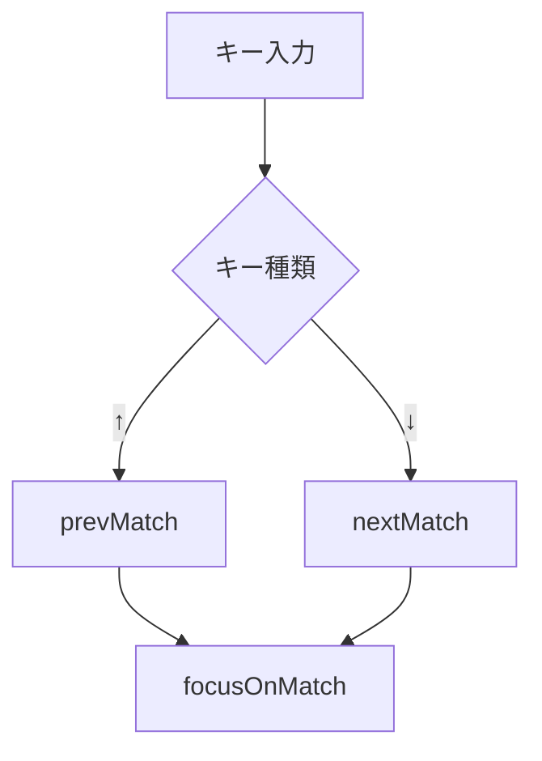

small-spring: 作る予定のSearchManagerのドキュメンテーションをお願いします。それを見ながら実装できるぐらい詳しく書いて。

GitHub Copilot: 
# SearchManager クラスドキュメンテーション

## 概要
`SearchManager`クラスは、脳構造グラフにおける検索機能を管理します。キーワード検索、結果のナビゲーション、UIの更新を担当します。

## クラス構造

### プロパティ
```typescript
{
    network: vis.Network,    // グラフの操作インターフェース
    allNodes: vis.DataSet,   // 全ノードデータ
    results: Node[],         // 検索結果の配列
    currentIndex: number,    // 現在選択中の結果のインデックス
    visibleIndexes: number[], // 表示可能な結果のインデックス
    elements: {              // DOM要素への参照
        searchBox: HTMLInputElement,    // 検索入力欄
        matchStatus: HTMLElement,       // 検索結果数表示
        matchList: HTMLElement,         // 検索結果リスト
        levelInput: HTMLInputElement    // レベル指定入力欄
    }
}
```

### メソッド

#### 初期化関連
```typescript
constructor(network: vis.Network, allNodes: vis.DataSet)
- 引数: network(グラフ操作用), allNodes(全ノードデータ)
- 処理: プロパティの初期化、DOM要素の取得、イベントリスナーの設定

initializeDOM()
- 処理: DOM要素の参照を取得・保存

setupEventListeners()
- 処理: キーボードイベントの設定（Enter:検索, ↑↓:移動, Esc:クリア）
```

#### 検索機能
```typescript
search()
- 処理: 
  1. 検索ボックスから入力値を取得
  2. キーワードでノードをフィルタリング
  3. 結果の表示とフォーカス
- 結果表示: 
  - 成功時: 結果リスト表示、最初のノードにフォーカス
  - 失敗時: エラーメッセージ表示

clear()
- 処理: 
  1. 内部状態のリセット（results, currentIndex）
  2. UI表示のクリア（ステータス、リスト）
```

#### ナビゲーション
```typescript
prevMatch()
- 処理: 表示可能な前の結果へ移動
- 循環: 最初の結果の前は最後の結果

nextMatch()
- 処理: 表示可能な次の結果へ移動
- 循環: 最後の結果の次は最初の結果

focusOnMatch()
- 処理: 
  1. 現在の結果ノードを取得
  2. グラフ上でノードを選択・フォーカス
  3. ステータス表示の更新
  4. リストのハイライト更新
```

#### UI更新
```typescript
updateMatchList(maxLevel: number)
- 引数: maxLevel(表示する最大レベル)
- 処理: 
  1. 結果リストをクリア
  2. 結果を表示可能性でフィルタリング
  3. リストアイテムの生成と表示

updateMatchStatus()
- 処理: ステータス表示の更新（"X / Y matches"）

isVisible(node: Node, maxLevel: number): boolean
- 引数: node(対象ノード), maxLevel(表示最大レベル)
- 戻値: 表示可能かどうか
```

## イベントフロー

### 検索実行時
```mermaid
graph TD
    A[検索ボックス入力] --> B[search()]
    B --> C{結果あり?}
    C -->|Yes| D[updateMatchList]
    D --> E[focusOnMatch]
    C -->|No| F[エラー表示]
```

### キーボードナビゲーション


## 使用例
```javascript
// 初期化
const searchManager = new SearchManager(network, allNodes);

// イベントは自動的に処理される
// - 検索ボックスでEnterを押す → 検索実行
// - ↑↓キーで結果間移動
// - Escでクリア
```

## エラーハンドリング
- 検索結果なし: アラート表示
- 非表示ノード: リストで無効化表示
- 不正なインデックス: 循環的に正しい値に補正

## パフォーマンス考慮事項
- DOM要素へのアクセスは`this.elements`経由で一元管理
- 検索結果のキャッシュ（`this.results`）
- 表示可能な結果のインデックスをキャッシュ（`this.visibleIndexes`）